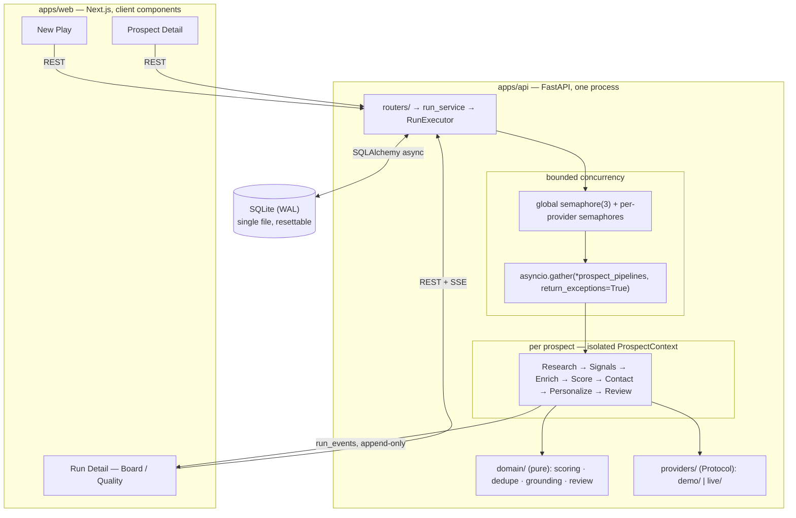

# Groundwork

Groundwork turns a plain-language growth objective into evidence-backed, scored prospects with
drafted outreach — and it will not take an external action without a human. It's a prototype built to
demonstrate one thesis end to end: **use an LLM where ambiguity is genuinely valuable (research
extraction, personalization); use deterministic code for everything that has to be correct, auditable,
and reproducible (orchestration, ICP scoring, guardrails).**

Everything on screen is computed by one real engine. Demo Mode and a future Live Mode share the exact
same orchestrator, scoring rubric, and review checks — only the `LLMProvider` / `SearchProvider`
implementation behind a Protocol changes.

> **This is a P0 prototype.** Demo Mode runs entirely against a fictional, deterministic YAML fixture
> pack. It performs **no outbound network calls** — no real search, no real LLM, no email/LinkedIn/CRM
> integration. Every score, status, duplicate flag, and review verdict on screen is computed at run
> time by the real engine from that fixture evidence; nothing is precomputed or hardcoded.

---

## What it does

1. **New Play** — describe a GTM objective in plain language. It's parsed into a structured `PlaySpec`
   (target industries, size band, funding stage, persona, score/confidence thresholds) shown read-only
   beside the form.
2. **Run Agents** — a bounded number of prospects (default 7, matching the fixture pack) are
   discovered, deduped, and researched **concurrently and independently**. One prospect failing does
   not fail the run.
3. Each prospect runs a fixed 7-step pipeline: `Research → Signals → Enrich → Score → Contact →
   Personalize → Review`.
4. A human reviews the outcome — score breakdown, evidence with provenance, grounded outreach, seven
   deterministic guardrail checks — and approves or rejects. Approval is an audit-trail entry; it never
   triggers an external side effect.
5. A **Quality tab** reports evidence coverage, grounded-claim rate, guardrail pass rates, and step
   reliability — computed on read from the run's own records, not a metrics table that can drift.

---

## Architecture



Two processes, one command: `make dev` runs the API on `:8000` and the web app on `:3000`.

Full rationale and the section-by-section build plan live in `docs/IMPLEMENTATION_PLAN.md`; the
condensed five-minute version is `docs/ARCHITECTURE.md`.

---

## Deterministic vs. LLM responsibilities

| Component | Classification | Why |
|---|---|---|
| Objective → PlaySpec | LLM (deterministic fallback) | Real ambiguity in free text; schema-validated output. |
| Pipeline construction | **Deterministic** | The DAG is a fixed 7-step list, not a model's plan. Variance here is a cost, not a feature. |
| Research extraction | LLM | Unstructured sources → structured `ResearchFacts`, Pydantic-validated. |
| Signal detection | Hybrid | LLM proposes; a deterministic verifier confirms the cited span actually appears in the source and belongs to this prospect. |
| Enrichment | **Deterministic** | Field precedence + an explicit `UNKNOWN` sentinel — never interpolated. |
| **ICP scoring** | **Deterministic** (LLM writes the explanation only) | Reproducible, auditable, tunable, unit-tested. The LLM narrates the number; it cannot move it. |
| Contact resolution | **Deterministic** | A fabricated contact is the most dangerous hallucination in GTM — never generated. |
| Personalization | LLM | Where ambiguity is genuinely valuable. |
| **Review verdict** | **Deterministic — no LLM anywhere in this path** | The model that wrote the draft cannot be its own grader. |
| Dedupe | **Deterministic** | Normalization + comparison. |
| Evaluation metrics | **Deterministic** | Computed on read from persisted records, every run. |

**One-line thesis:** LLMs for ambiguity and language; deterministic code for arithmetic, identity, and
policy.

---

## Evidence & provenance

Every claim a prospect carries — a signal, a score dimension, an outreach sentence — points at
`evidence_ids`. Every evidence row is typed by origin:

- `DEMO_FIXTURE` — synthetic, authored for this prototype. **Structurally forbidden from carrying a
  real-looking `source_url`** — enforced by a Pydantic model validator, not a UI convention, and
  asserted by `test_fixture_provenance.py`. The UI renders these with an explicit `SYNTHETIC` badge and
  a non-clickable "demo fixture" caption.
- `LIVE_FETCH` — a real fetched source; the only origin allowed to carry a clickable `source_url` (P1,
  not built).
- `LLM_INFERENCE` — a model-asserted claim with no external source; rendered with a dashed border and
  "unsourced" label so it never reads like a citation.

The **ICP score** is eight weighted dimensions computed by pure arithmetic (`domain/scoring.py`), with
an evidence gate that zeroes any dimension lacking a supporting citation and a hard-disqualifier
modifier for excluded industries. Two dimensions (`industry_fit`, `size_fit`) are read directly from the
company's structural profile rather than a citable claim, so the UI marks them "supported · profile"
instead of showing a misleadingly-empty evidence count.

**Review** is seven deterministic checks (`claim_grounding`, `no_fabricated_contact`,
`cross_prospect_leak`, `no_placeholders`, `duplicate_account`, `score_support`, `confidence_floor`) —
any hard-check failure → `FAIL`, any soft-check failure → `NEEDS_REVIEW`, otherwise `PASS`. No LLM
anywhere in this path.

---

## Concurrency & isolation

One coroutine per prospect, each running its own topologically-ordered pipeline against its own
`ProspectContext` — the isolation boundary that owns every mutable field (facts, evidence, signals,
score, contact, drafts). No shared dict, no cross-prospect reads.

```python
async def execute_run(run_id: str) -> None:
    prospects = await discover_and_dedupe(run_id)
    gate = asyncio.Semaphore(settings.max_concurrent_prospects)   # default 3

    async def one(p: Prospect) -> ProspectOutcome:
        async with gate:
            ctx = ProspectContext.for_prospect(run_id, p)         # isolation boundary
            return await PROSPECT_PIPELINE.execute(ctx)

    tasks = [asyncio.create_task(one(p)) for p in prospects]
    await asyncio.gather(*tasks, return_exceptions=True)          # failure isolation
    await finalize_run(run_id)
```

`gather(..., return_exceptions=True)` is deliberate, not an oversight: `asyncio.TaskGroup` cancels every
sibling on the first unhandled exception (correct for one indivisible operation); prospects are
independent units where partial success is the point — one failing must never take down the run.

Four mechanisms keep this from being just a promise:

1. No shared mutable state — everything lives on `ProspectContext`.
2. Prompt envelopes are built only from `ctx` — no conversation object accumulates cross-prospect
   history.
3. `test_isolation.py` runs two confusable prospects with unique canary tokens through the real engine
   concurrently and asserts zero contamination in evidence, signals, explanation, or outreach.
4. A runtime guardrail (`cross_prospect_leak`) scans every outreach draft, on every run, on real data,
   for another prospect's name or domain.

Per-step reliability: `asyncio.wait_for` per attempt, exponential backoff + jitter, one `agent_tasks`
row per attempt, idempotency key `(run_id, prospect_id, step_name)`, and a run-level wall-clock
watchdog.

---

## Demo Mode vs. Live Mode

They are **the same code path**. `providers/registry.py` builds a `ProviderBundle` from
`LLMProvider` / `SearchProvider` Protocols; only the implementation behind those Protocols differs.
Nothing in `engine/`, `domain/`, or `api/` special-cases "if demo mode" — that would defeat the point.

Demo Mode (`providers/demo/`) is what's built and running today: deterministic templating and a
fixture-derived structured LLM response, seeded jitter, and fixture-configured scripted retries/
failures, all driven from `groundwork/fixtures/demo_pack.yaml` — 7 fictional companies engineered to
produce a genuine mix of `PASS` / `NEEDS_REVIEW` / `REJECTED` / `DUPLICATE` / `FAILED` outcomes, computed
by the real engine, not scripted per company.

Live Mode (`providers/live/`) — a real search provider and OpenAI — is **not built**. Requesting it
returns a clean `NotImplementedError`/422, not a silent fallback.

---

## Local setup

Requirements: Python (managed by [`uv`](https://docs.astral.sh/uv/)), Node + `pnpm`.

```bash
git clone <this repo>
cd prospect-os
make dev          # API on :8000, web app on :3000
```

Open `http://localhost:3000` — it redirects to **New Play**.

### Other commands

```bash
make api          # API only, :8000
make web          # web app only, :3000
make test         # backend test suite (cd apps/api && uv run pytest)
make demo-reset   # wipe the local SQLite DB and recreate the schema — deterministic clean slate
make demo         # run the full Demo Mode engine headlessly (no FastAPI, no React) and print the trace
```

`make demo-reset && make dev` is the reliable way to get back to a rehearsal-ready state before a
walkthrough — see `docs/DEMO_SCRIPT.md`.

---

## What's real vs. synthetic, explicitly

| | Status |
|---|---|
| Orchestrator, scoring, review, dedupe, grounding | Real code, real arithmetic, unit-tested |
| Evidence, signals, scores, contacts, outreach, review verdicts on screen | Computed live from fixture evidence by the real engine — nothing precomputed |
| Search results, LLM extraction | **Simulated** — `providers/demo/` implementations reading `demo_pack.yaml`, no network call |
| Outbound email / LinkedIn / CRM | **Does not exist.** Approve/reject is a state transition in an audit table; there is no provider wired in to send anything |
| SQLite, single process, `asyncio` fan-out | Real, and intentionally the right choice at this scale (see below) |

---

## Production-scaling notes

At 7 prospects this is `asyncio` in one process against SQLite (WAL mode). That's the correct choice
here — zero infrastructure, a single resettable file, `make demo-reset` in under a second. It stops
being the right choice well before "agentic AI at scale" is the interesting problem:

- **SQLite's single-writer lock** is the first real ceiling, roughly in the 20–30-concurrent-prospect
  range — not the orchestration model, which already fans out cleanly.
- Next: **Postgres**, for concurrent writers and connection pooling.
- Then: **distributed rate limiting** across provider calls, once more than one process is issuing them.
- Only once run duration makes **mid-deploy interruption** unacceptable does a durable workflow engine
  (Temporal-shaped, not a bigger asyncio loop) earn its complexity — and the seams for that migration
  already exist: steps are idempotent by `(run_id, prospect_id, step_name)`, all state lives in the DB
  rather than in memory, and providers sit behind Protocols rather than being called inline.

The event log (`run_events`, append-only, replayed over SSE with a resumable `after_seq` cursor) was
built the way a distributed system would need it to work anyway — not because 7 prospects require it.

---

## Repository layout

```
apps/api/groundwork/
  domain/        pure — scoring, dedupe, grounding, review. No I/O, no provider/repo imports.
  engine/        context, step, pipeline, runner — the isolation + concurrency + retry machinery.
  providers/     LLMProvider / SearchProvider Protocols; demo/ implementation (live/ is P1).
  api/           FastAPI routers, service layer, evaluation metrics.
  models/        Pydantic schemas + SQLAlchemy tables.
  fixtures/      demo_pack.yaml — the 7-company deterministic evidence pack.
apps/web/
  app/           New Play, Run Detail (Board/Quality), Prospect Detail.
  components/    ScoreBreakdown, EvidenceCard, ReviewPanel, MetricGrid, GuardrailPanel, etc.
  lib/           typed API client, SSE hook (useRunStream), formatting helpers.
docs/
  IMPLEMENTATION_PLAN.md   full plan — source of truth for scope and rationale.
  ARCHITECTURE.md          condensed map for a five-minute refresh.
  PROGRESS.md              living build state, checkpoint by checkpoint.
  DEMO_SCRIPT.md           the founder walkthrough, timed, with discussion-point answers.
```
